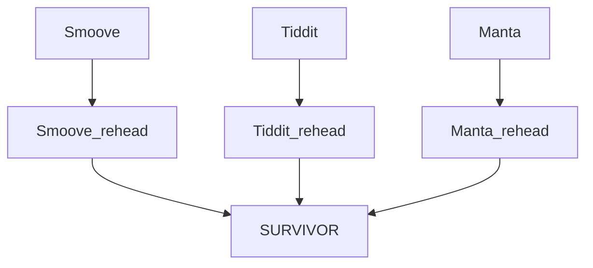

# How to: pass output from one process as input for another process for multiple samples

|Nextflow feature     |Tags                                   |DSL2             |
|---------------------|---------------------------------------|-----------------|
| Processes, workflow |multi-sample, output, input |:heavy_check_mark:|

## Scenario  

When you need to process multiple samples at once using an input sample file and pass outputs generated by one process to another process for each sample separately. For example in the GermlineStructuralV pipeline we needed to feed output from one SV caller to a reheader process for each sample VCF generated:  




## The fix

You can use the `emit` option to assign names to process output definitions. You can use these outputs as inputs in downstream processes without needing to directly associate them with a sample. In the following example we have taken a vcf file and its index output by Manta and then renamed the sampleID in the vcf's header. 

Given the input to the manta{} process was mapped to each sample using the val path tuple, outputs can specify `${sampleID}`. The rehead_manta{} process takes the  output files from the manta{} process and `${sampleID}` as a tuple and two outputs of Manta, as defined by `emit:`.

In the `manta.nf` file:  
```
#!/usr/bin/env nextflow

// Enable DSL-2 syntax
nextflow.enable.dsl=2

// Define the process
process manta {
	debug true
	publishDir "${params.outDir}/${sampleID}", mode: 'copy'
	container "${params.mulled__container}"
	
	input:
	tuple val(sampleID), file(bam), file(bai)
	path(ref)
	path(ref_fai)

	output:
	path("manta/Manta_${sampleID}.candidateSmallIndels.vcf.gz")  	, emit: manta_small_indels
    	path("manta/Manta_${sampleID}.candidateSmallIndels.vcf.gz.tbi")	, emit: manta_small_indels_tbi
    	path("manta/Manta_${sampleID}.candidateSV.vcf.gz")             	, emit: manta_candidate
    	path("manta/Manta_${sampleID}.candidateSV.vcf.gz.tbi")         	, emit: manta_candidate_tbi
    	path("manta/Manta_${sampleID}.diploidSV.vcf.gz")               	, emit: manta_diploid
    	path("manta/Manta_${sampleID}.diploidSV.vcf.gz.tbi")           	, emit: manta_diploid_tbi
	path("manta/Manta_${sampleID}.diploidSV_converted.vcf.gz")	, emit: manta_diploid_convert
	path("manta/Manta_${sampleID}.diploidSV_converted.vcf.gz.tbi")	, emit: manta_diploid_convert_tbi

	script:
	"""
	# configure manta SV analysis workflow
		configManta.py \
		--normalBam ${bam} \
		--referenceFasta ${params.ref} \
		--runDir manta \

	# run SV detection 
	manta/runWorkflow.py -m local -j 12

	# clean up outputs
	mv manta/results/variants/candidateSmallIndels.vcf.gz \
		manta/Manta_${sampleID}.candidateSmallIndels.vcf.gz
	mv manta/results/variants/candidateSmallIndels.vcf.gz.tbi \
		manta/Manta_${sampleID}.candidateSmallIndels.vcf.gz.tbi
	mv manta/results/variants/candidateSV.vcf.gz \
		manta/Manta_${sampleID}.candidateSV.vcf.gz
	mv manta/results/variants/candidateSV.vcf.gz.tbi \
		manta/Manta_${sampleID}.candidateSV.vcf.gz.tbi
	mv manta/results/variants/diploidSV.vcf.gz \
		manta/Manta_${sampleID}.diploidSV.vcf.gz
	mv manta/results/variants/diploidSV.vcf.gz.tbi \
		manta/Manta_${sampleID}.diploidSV.vcf.gz.tbi
	
	# convert multiline inversion BNDs from manta vcf to single line
	convertInversion.py \$(which samtools) ${params.ref} \
		manta/Manta_${sampleID}.diploidSV.vcf.gz \
		> manta/Manta_${sampleID}.diploidSV_converted.vcf

	# zip and index converted vcf
	bgzip manta/Manta_${sampleID}.diploidSV_converted.vcf
	tabix manta/Manta_${sampleID}.diploidSV_converted.vcf.gz
	"""
} 

process rehead_manta {
	debug true 
	publishDir "${params.outDir}/${sampleID}/manta", mode: 'copy'
	container "${params.bcftools__container}"

	input:
	tuple val(sampleID), path(manta_diploid_convert)
	tuple val(sampleID), path(manta_diploid_convert_tbi)
		
	output:
	path("Manta_*.vcf")	, emit: FinalVCF	
		
	script:
	"""
	# create new header for merged vcf
	printf "${sampleID}_manta\n" > ${sampleID}_rehead_manta.txt

	# replace sampleID with caller_sample for merging 	
	bcftools reheader \
		Manta_${sampleID}.diploidSV_converted.vcf.gz \
		-s ${sampleID}_rehead_manta.txt \
		-o Manta_${sampleID}.vcf
	"""
}
```

In the main.nf file: 
```
#!/usr/bin/env nextflow

nextflow.enable.dsl=2

// Import subworkflows to be run in the workflow
include { manta }           from './modules/manta'
include { rehead_manta }    from './modules/manta'


workflow {
// Check inputs file exists
checkInputs(Channel.fromPath(params.input, checkIfExists: true))
  
// Split cohort file to collect info for each sample
input = checkInputs.out
        .splitCsv(header: true, sep:"\t")
        .map { row -> tuple(row.sampleID, file(row.bam), file(row.bai))}

// Call SVs with Manta  
  manta(input, params.ref, params.ref+'.fai')

// Rehead manta vcf for merging 
  rehead_manta(manta.out.manta_diploid_convert, manta.out.manta_diploid_convert_tbi)
}

```

## Considerations 


